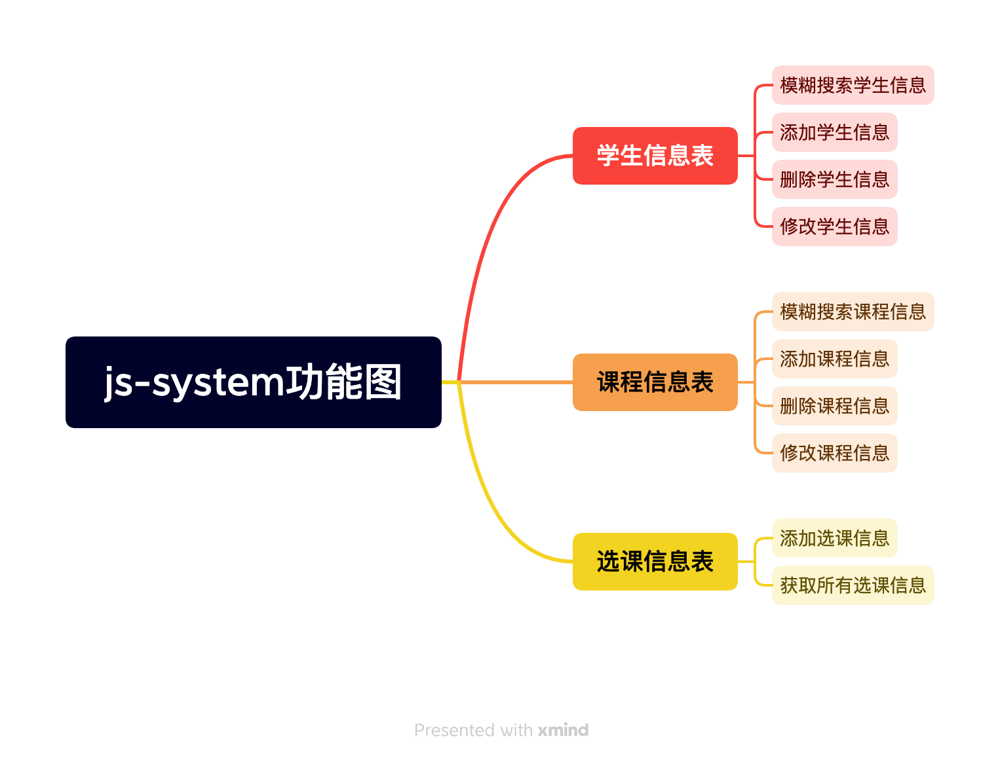
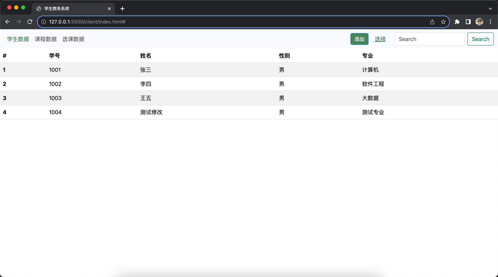
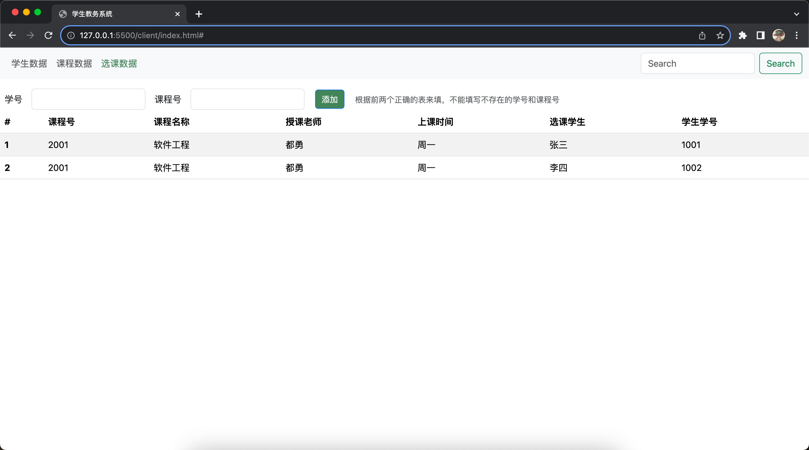
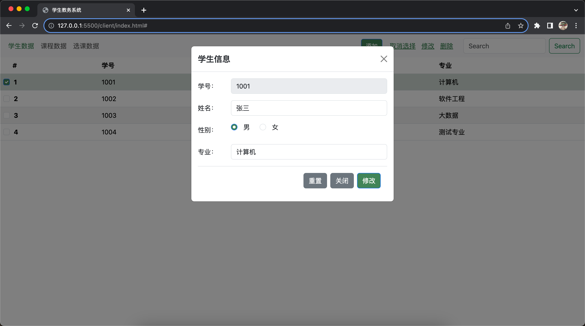

## 学生教务系统简单模拟

大三上数据库系统专业课的一个小实验，就写了几天，有点水

### 主要实现功能

1. 学生信息的**增删改查**，以及学生信息的**模糊查询**
2. 课程信息的**增删改查**，以及课程信息的**模糊查询**
3. 选课信息的**增加**和**查看所有**

### 功能图



### 数据库设计

注：都是小写，没有加‘s’

没有额外设置诸如Sno的学号属性，主要原因是懒...索性拿id当学号了

1. student表

| id   | name | sex             | speciality |
| :--- | ---- | --------------- | ---------- |
| 学号 | 姓名 | 性别 0：女 1:男 | 专业       |

2. course表

| id     | name     | teacher  | time     |
| ------ | -------- | -------- | -------- |
| 课程号 | 课程名称 | 授课教师 | 授课时间 |

3. sc表

| stu_id                      | cou_id                     |
| --------------------------- | -------------------------- |
| 外键，对应student表的id主键 | 外键，对应course表的id主键 |

### 技术栈

1. 前端
   - vue2没用组件化就简单用了一个页面
   - 样式框架是Bootstrap
   - 网络请求库用的axios，二次封装了一下
2. 后端
   - node的express框架
   - cors中间件做的跨域请求
   - body-parser中间件解析请求体
   - 数据库mysql

### 目录结构

```
.
├── README.md
├── client
│   ├── api
│   │   ├── http.js
│   │   └── index.js
│   ├── app.js
│   └── index.html
└── service
    ├── app.js
    ├── db
    │   ├── courseDB.js
    │   ├── db.js
    │   ├── scDB.js
    │   └── stuDB.js
    ├── package-lock.json
    ├── package.json
    └── routes
        ├── course.js
        ├── sc.js
        └── students.js
```

### 页面截图







### 选课信息功能写的比较少

主要原因是这三个表功能其实都差不多，选课信息作为前两个的子表存的只有学生id和选课id两个外键，搜索就是通过一个或两个id使用sql的联合（join）语句写查询，功能都差不多就没写了

### 几个不足的地方

- 因为实验也没有要求加上很麻烦就没有写异常处理，不用组件自己封装还是有点浪费时间就没整一些错误成功的提示
- 选课信息的添加本来想自己写一个远程搜索+下拉菜单展示的，也是因为这个实验浪费了好几个晚上就不想再给时间了就没写
- 同样也是没有用组件化几个table就复制粘贴，很💩山，但是可以用

### 查看效果

1. 修改数据库相关配置，在service/db/db.js文件中修改，并在你的数据中建好三张表
2. 在service目录下执行`npm install`命令安装需要的包
3. 先在service目录下执行node app.js
4. 最后确保上述三步运行成功，在client目录下用浏览器打开index.html就可以了
